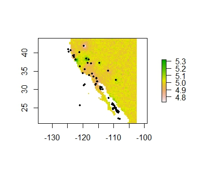
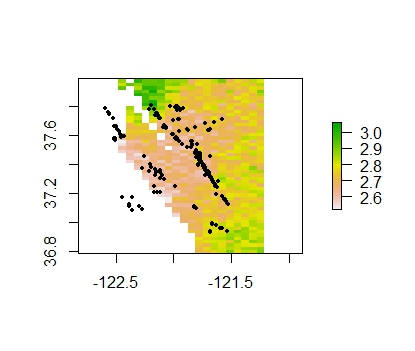
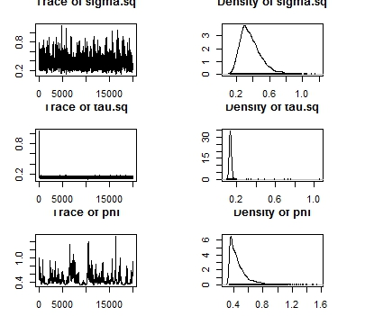
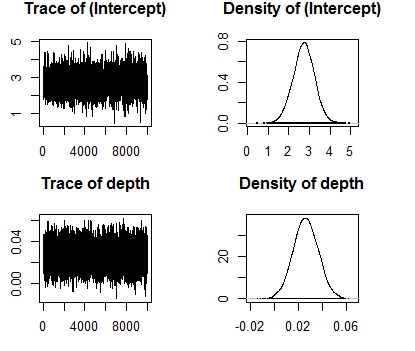

# Introduction and Data

If we could predict the time, location, and size of earthquakes, it would be very helpful in order to save lives. However, all of these are very difficult to predict. For our project, we will attempt to apply spatial and temporal models learned in class to look for patterns and further understand these models. 

The original data set comes from https://kaggle.com/usgs/earthquake-database, and it contains all earthquakes with a magnitude greater than 4.5. After finding the reference for this dataset, at https://earthquake.usgs.gov/earthquakes/search/, we were able to pull different queries of years, magnitudes, and areas, so we could further explore the data on earthquakes. Because the data is individual points, we are using models that are based on point-reference data. 

Different datasets were used for various approaches. the world data set is the one from kaggle that covers 1965-2016 with magnitudes greater than 4.5. The bay area data set covers about 10 years of data from April 28, 2007 until May 1, 2017 set to a rectangle of the San Francisco bay area, which is Latitude: [36.94, 37.79] and Longitude: [-122.57, -121.75]. The magnitudes are restricted to grater than 2.5. The California/Mexico dataset includes California going down to the Northern part of Mexico and covers data from April 21, 2012 to April 28, 2017. The Chile dataset includes the area around Chile and also covers data from April 21, 2012 to April 28, 2017. 

The measurement of magnitudes of earthquakes is also complicated as a unit of measurement. The scale is based on a logarithmic scale, and there are multiple ways to measure it based on seismic activity. For the sake of this project, various measurements of magnitude were treated equally. 

# Exploratory Data Analysis 

```{r, message=FALSE, warning=FALSE}
library(spBayes)
library(ggplot2)
library(ggmap)
library(dplyr)
library(gridExtra)
library(lubridate)
library(tidyverse)
library(forecast)
library(zoo)
library(lubridate)
```

## Magnitude > 4.5 
### Global Earthquakes

```{r, message=FALSE, warning=FALSE}
cali_df = read.csv("datasets/cali_df.csv")
chile_df = read.csv("datasets/chile_df.csv")
all = read.csv("datasets/kaggle_data.csv")
bayarea = read.csv("datasets/bayarea.csv")

map.world = map_data(map = "world")
chile_map = map.world %>%
  filter(region == "Chile") %>%
  filter(long > -90)
cali_map = map_data("state", "california")
mexico_map = map_data(map = "world", region = "mexico")
states_map = map_data(map = "state")

# big earthquakes
big = all %>%
  dplyr::filter(Magnitude > 7)
# small earthquakes
small = all %>%
  dplyr::filter(Magnitude <= 7)

# all earthquakes
all_map = ggplot() + 
  geom_polygon(data = map.world, aes(x = long, y = lat, group = group),
               fill = "white", color = "black") + 
    geom_point(data = small, aes(x = Longitude, y = Latitude, color = ">4.5"), 
               size = 0.2) +
  geom_point(data = big, aes(x = Longitude, y = Latitude, color = ">7.0"), 
             size = 0.75) +
  coord_fixed(1.3) +
  scale_colour_manual("Magnitude", values = c("darkblue", "red")) +
  ggtitle("Earthquakes 1965-2017, Magnitudes > 4.5") +
  xlab("") +
  ylab("")

all_map
```

This map shows the entire data set of earthquakes with magnitudes greater than 4.5 from 1965 to 2016. The earthquakes with magnitudes greater than 7 are colored in red to show certain areas of the world that tend to have higher magnitudes of earthquakes. From this plot, we can see certain areas of the world tend to have higher earthquake magnitudes than other parts of the world. 


### California-Mexico and Chile

Next, we plot the same map as above but zoom in on two regions, specifically Chile and a comparable size in California and part of Mexico. 

```{r, message=FALSE, warning=FALSE}
# subset chile
chile_small = small %>%
  filter(Longitude < -60, Longitude > -80, 
         Latitude < -15, Latitude > -60)
chile_big = big %>%
  filter(Longitude < -60, Longitude > -80, 
         Latitude < -15, Latitude > -60)
map_one = map.world %>%
   filter(long < -60, long > -80, 
         lat < -15, lat > -60)

# zoom in on California and baja
cali_small = small %>%
  filter(Longitude > -125, Longitude < -100, 
         Latitude > 15, Latitude < 42.5)
cali_big = big %>%
  filter(Longitude > -125, Longitude < -100, 
         Latitude > 15, Latitude < 42.5)
mexico_map = map.world %>%
  filter(long > -125, long < -100, 
         lat > 15,lat< 42.5)
states_map = states_map %>%
  filter(long > -125, long < -100, 
         lat > 15,lat< 42.5)


# zoom in on chile
chile_ggplot = ggplot() + 
  geom_polygon(data = chile_map, aes(x = long, y = lat, group = group), 
               fill = "white", color = "black") + 
    geom_point(data = chile_small, aes(x = Longitude, y = Latitude, 
                                       color = ">4.5"),
               size = 0.75) +
  geom_point(data = chile_big, aes(x = Longitude, y = Latitude,
                                   color = ">7.0"), 
            size= 2) +  
  scale_colour_manual("Magnitude", values = c("darkblue", "red")) +
  coord_fixed(1.3) +
  ggtitle("Chile") +
  xlab("") +
  ylab("")

# california earthquakes
cali_ggplot = ggplot() + 
  geom_polygon(data = cali_map, aes(x = long, y = lat, group = group), 
               fill = "white", color = "black") + 
  geom_path(data = mexico_map, aes(x = long, y = lat, group = group), 
               color = "black") +
  geom_point(data = cali_small, aes(x = Longitude, y = Latitude, 
                                    color = ">4.5"), size = .75) +
  geom_point(data = cali_big, aes(x = Longitude, y = Latitude,
                                  color = ">7.0"), size = 2) + 
  scale_colour_manual("Magnitude", values = c("darkblue", "red")) +
  coord_fixed(1.3) +
  ggtitle("California/Mexico") +
  xlab("") +
  ylab("")

# show in .rmd and .html
grid.arrange(chile_ggplot, cali_ggplot, nrow = 1,
             top = "Earthquakes 1965-2016, Magnitudes > 4.5")
```

From this plot, it looks like Chile has more bigger earthquakes than California does. 

### Indonesia

Looking at Indonesisa because the interesting shape in the faults.

```{r, message=FALSE, warning=FALSE}
# subset indonesia
indonesia_map = map.world %>%
  filter(region == "Indonesia") 

indonesia = all %>%
 filter(Latitude < 10, Latitude > -15, 
         Longitude < 145, Longitude > 90)
indonesia_big = indonesia %>%
  filter(Magnitude > 7.0)
indonesia_small = indonesia %>%
  filter(Magnitude <= 7.0)

indonesia_plot = ggplot() +
  geom_polygon(data = indonesia_map, aes(x = long, y = lat, group = group),
               fill = "white", color = "black") +
  geom_point(data = indonesia_small, aes(x = Longitude, y = Latitude), size = 0.75, color = "darkblue") +
  geom_point(data = indonesia_big, aes(x = Longitude, y = Latitude), size = 2, color = "red") +
  coord_fixed(1.3) + 
  ggtitle("Earthquakes in Indonesia, 1965-2016, Magnitudes > 4.5")

indonesia_plot
```


## Magnitudes > 2.5

### California-Mexico and Chile

After looking at only the magnitudes above 4.5, it seems important to also look at smaller earthquakes. Now, we will viualize earthquakes that are also above a magnitude of 2.5. Once you start looking at data below 2.5, there starts to be exponentially more data to work with.

```{r, message=FALSE, warning=FALSE}
## plot > 2.5
chile_df$time = ymd_hms(chile_df$time)
cali_df$time = ymd_hms(cali_df$time)

chile = filter(chile_df, year(time) %in% c(2016,2017))
cali = filter(cali_df, year(time) %in% c(2016,2017))

chile_small_2016 = chile %>%
  filter(mag < 4.5)
chile_med_2016 = chile %>%
  filter(mag >= 4.5)
chile_big_2016 = chile %>%
  filter(mag >= 7)

cali_small_2016 = cali %>%
  filter(mag < 4.5)
cali_med_2016 = cali %>%
  filter(mag >= 4.5)
cali_big_2016 = cali %>%
  filter(mag >= 7)

chile_2016_ggplot = ggplot() + 
  geom_polygon(data = chile_map, aes(x = long, y = lat, group = group), 
               fill = "white", color = "black") + 
  geom_point(data = chile_small_2016, aes(x = longitude, y = latitude,
                                          color = ">2.5"), 
             size = 0.75) +
  geom_point(data = chile_med_2016, aes(x = longitude, y = latitude,
                                        color = ">4.5"), 
             size = 1) +
  geom_point(data = chile_big_2016, aes(x = longitude, y = latitude, 
                                        color = ">7.0"), 
               size = 3) + 
  coord_fixed(1.3) +
  scale_colour_manual(name="Magnitude", 
                      values = c("green", "darkblue", "red")) +
  ggtitle("Chile") +
  xlab("") +
  ylab("")


cali_2016_ggplot = ggplot() + 
  geom_polygon(data = cali_map, aes(x = long, y = lat, group = group), 
               fill = "white", color = "black") + 
  geom_path(data = mexico_map, aes(x = long, y = lat, group = group), 
               color = "black") + 
  geom_point(data = cali_small_2016, aes(x = longitude, y = latitude, 
                                         color = ">2.5"), size = 0.75) +
  geom_point(data = cali_med_2016, aes(x = longitude, y = latitude, 
                                       color = ">4.5"), size = 1) +
  #geom_point(data = cali_big_2016, aes(x = longitude, y = latitude, 
  #                                     color = ">7"), size = 3) + 
  scale_colour_manual(name="Magnitude", values = c("green", "darkblue")) +
  ggtitle("California/Mexico") +
  coord_fixed(1.3) +
  xlab("") +
  ylab("")

# show in .html
grid.arrange(chile_2016_ggplot, cali_2016_ggplot, nrow = 1, 
             top = "Earthquakes Jan 2016 - Apr 2017, Magnitudes > 2.5")

```


# Histograms of Magnitudes

```{r, message=FALSE, warning=FALSE}
cali_hist = ggplot() +
  geom_histogram(data = cali_df, aes(x = mag), bins = 30) +
  ggtitle("California/Mexico")

chile_hist = ggplot() +
  geom_histogram(data = chile_df, aes(x = mag), bins = 30) +
  ggtitle("Chile")

grid.arrange(chile_hist, cali_hist,
             top = "Earthquakes Jan 2012 - Apr 2017, Magnitudes > 2.5")
```

These histograms also confirm that the average magnitude in California/Mexico is lower than the average magnitude of earthquakes along Chile. 

# Depth and Magnitude Type
```{r, message=FALSE, warning=FALSE}
cali_depth = ggplot() +
  geom_point(data = bayarea, aes(x = depth, y  = mag)) +
  ggtitle("Depth vs. Magnitude in Bay Area")

cali_magtype = ggplot() +
  geom_boxplot(data = bayarea, aes(x = magType, y = mag)) +
  ggtitle("Mag Type vs. Magnitude in Bay Area")

grid.arrange(cali_depth, cali_magtype,
             top = "10 years of Earthquakes, Magnitudes > 2.5")
```

Depth of the earthquake and magnitude don't seem to have a very obvious relationship, even when focusing on a particular area or looking generally at larger areas. We included depth because depth was the only usable covariate in the dataset. We will also compare depth in the a simple model to then using depth included in a spatial model. 


## EDA: Hierarchical Clustering

Only using latitude and longitude as covariates for clustering:

```{r}
fault_line = all %>%
  filter(Latitude < 50, Latitude > -50,
         Longitude > -150, Longitude < 0)

points = fault_line %>%
  dplyr::select(Longitude, Latitude)

clusters <- hclust(dist(points))

fault_line$clusterCut <- cutree(clusters, 6)

clusterplot1 = ggplot(fault_line, aes(Longitude, Latitude, color = factor(clusterCut))) + 
  geom_point(alpha = 0.4, size = .5) +
  coord_fixed(1.3) +
  scale_color_discrete("") +
  ggtitle("Just Latitude/Longitude")
clusterplot1
```

Adding Depth and Magnitude as covariates:

```{r}
points = fault_line %>%
  dplyr::select(Longitude, Latitude, Depth, Magnitude)

clusters <- hclust(dist(points))

fault_line$clusterCut <- cutree(clusters, 6)
clusterplot2 = ggplot(fault_line, aes(Longitude, Latitude, color = factor(clusterCut))) + 
  geom_point(alpha = 0.4, size = .5) +
  coord_fixed(1.3) + 
  scale_color_discrete("") +
  ggtitle("Using Latitude/Longitude, Depth, and Magnitude")

clusterplot2
```

This clustering result is interesting because based solely on this part of the map, we can see how adding depth and magnitude clustered together a few vertical lines off the coast of Chile where the fault line is. Because of this, perhaps magnitude and depth might have spatial compenents beyond just occurence of earthquakes. Here, it looks like the spatial relationship involving magnitude and depth are based more on a linear spatial relationship, not a spatial relationship in all directions. This would be interesting to note for further investigation.

# Modeling

## Linear Regression

Starting with simple linear regression on the San Francisco Bay Area data set, we get the following result as a fit only using depth as a covariate. 

```{r}
fit_cali = lm(mag ~ depth, data = bayarea)
summary(fit_cali)
```

Although the p-value for depth is small because of the large number of points, the relationship is weak and not very linear. However, we continue to use depth in the spatial model to see if adding space adds more information to the model. 

## Spatial Models

Next we fit a Gaussian process to the magnitudes of earthquakes and looked for a spatial relationship in certain areas. The difficulty here is having too much data to build a spatial model with enough time to run. In addition, there are so many earthquakes below 2.5 that make it computationally infeasible, and cutting the magnitude at certain values seems arbitrary. However, we will cut the magnitudes off at certain values in order to procede. The code for the spatial models can be found in another .R script files in the repository. 

### California/Mexico 5 years, Mag > 4.5



### Bay Area 10 years, Mag > 2.5

 

 
 



## Time Modeling

Modeling this dataset with regards to time was also very difficult. There are lots of earthquakes, and the time relationship does not seem very obvious. Just looking at the time component of the data does not seem to achieve any valuable insights. Starting with the series for earthquakes in Chile from 2004 to 2017, the following plots are obtained:

```{r, message=FALSE, warning=FALSE}


#chile 2004-2017
earth = read.csv('datasets/chile_2004_today.csv')

chile0417 = earth %>%
                select(time, mag) %>%
                mutate(time=date(time)) %>%
                arrange(time, -mag) %>%
                filter (!duplicated (time))

chile0417_zoo = read.zoo(chile0417)

ggtsdisplay(chile0417_zoo, main='Chile 2004-2017')
```

Running an Arima model with the `forecast` project:

```{r}
auto.arima(chile0417_zoo)

model1 = Arima(chile0417_zoo, order = c(5, 1, 0))

model1 %>% residuals() %>% ggtsdisplay(points = F, 
                                     main = paste('AIC:', round(model1$aic)))
```

Comparing with the series for the last 5 years in Chile:

```{r}
#chile 5 years
earth = read.csv('datasets/chile_df.csv')

chile5 = earth %>%
    select(time, mag) %>%
    mutate(time=date(time)) %>%
    arrange(time, -mag) %>%
    filter (!duplicated (time))

chile5_zoo = read.zoo(chile5)

ggtsdisplay(chile5_zoo, main='Chile last 5 years')
```

Running the `auto.arima` function does not provide any insights on the time components:

```{r}
auto.arima(chile5_zoo)
```

So, depending on the time frame selected, different Arima models are obtained, and it seems hard to pick up a signal from the magnitudes across time. There was a fairly big earthquake in Chile in March 2010, looking at the earthquake time series for 2009 and 2010, the following plots are obtained:

```{r}
#filtering two years
earth = read.csv('datasets/chile_2004_today.csv')

chile_2year = earth %>% 
    select(time, mag) %>%
    mutate(time=date(time)) %>%
    arrange(time, -mag) %>%
    filter(!duplicated (time)) %>%
    filter(year(time) %in% c(2009, 2010))

chile2year_zoo = read.zoo(chile_2year)

ggtsdisplay(chile2year_zoo, main='Chile 2009 and 2010')
```

An Arima model on this last time series provides a third set of time components, so without the spatial component, time analysis does not seem appropriate:

```{r}
auto.arima(chile2year_zoo)

model3 = Arima(chile2year_zoo, order = c(1, 1, 1))

model3 %>% residuals() %>% ggtsdisplay(points = F, 
                                     main = paste('AIC:', round(model3$aic)))
```


# Future Considerations

There is much more left to be explored with this dataset. For the sake of this project, we focused on looking for patterns in magnitudes, rather than counts or occurences. An interesting analysis could definitely be done looking at occurences of earthquakes across time and space. In addition, we did build a large spatial model due to time constraints on our project. Maybe looking at other certain parts of the world would have other more obvious spatial or temporal patterns. We could also look into applying further models that we did not necessarily cover in this class. We also learned that applying spatio-temporal statistics to real data sets is complicated, frustrating, and time consuming. 


